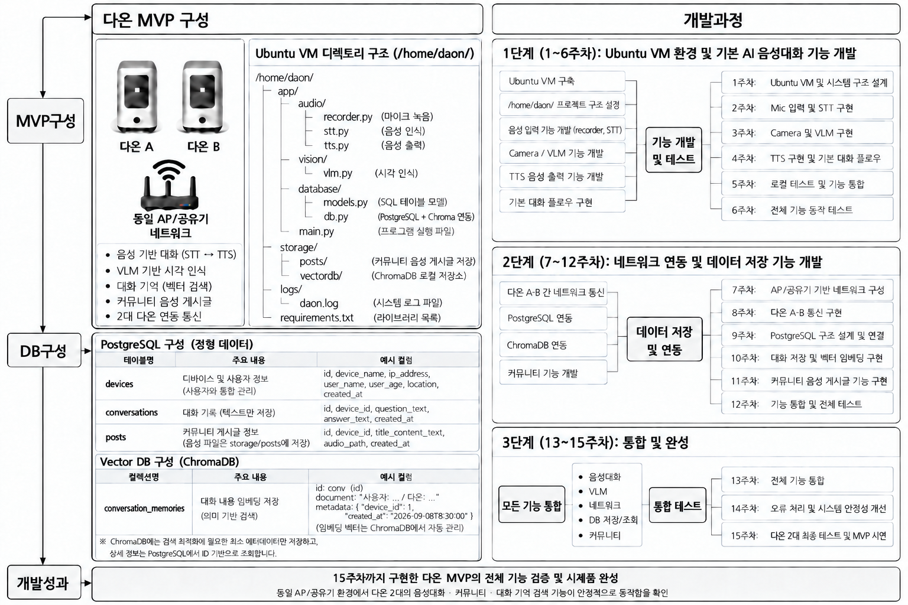

# Daon

## 1. Documentation

공식 문서를 기준으로 기술의 기본 개념과 사용 방법을 확인하고 최소한의 사용 조건 및 구조를 이해할 것

확인 내용:

- 기본 개념
- 사용 방법
- 주요 API
- 입력 및 출력 형식
- 주요 파라미터
- 공식 구조

## 2. SDK

사용하는 SDK와 라이브러리의 구조를 확인하며 어떤 양식으로 이루어져 있는지 확인 할 것

확인 내용:

- 주요 클래스
- 주요 함수
- 함수의 입력값
- 함수의 반환값
- 라이브러리 내부 구성
- 제공되는 기능

## 3. Model Structure

사용하는 모델의 전체 구조를 확인할 것

확인 내용:

- 입력 데이터
- 전처리 과정
- 모델 구조
- 추론 과정
- 출력 데이터
- 주요 파라미터
- 전체 데이터 흐름

## 4. Code Review

관련 코드를 직접 읽고 각 부분의 역할을 확인하며 GPT를 포함한 AGENT를 사용하되 반드시 자기가 이해가능하며 설명할 수 있는 코드를 짤 것

확인 내용:

- 각 코드의 역할
- 함수의 동작
- 입력값과 반환값
- 라이브러리 호출 과정
- 데이터가 이동하는 흐름
- 각 코드가 서로 연결되는 방식